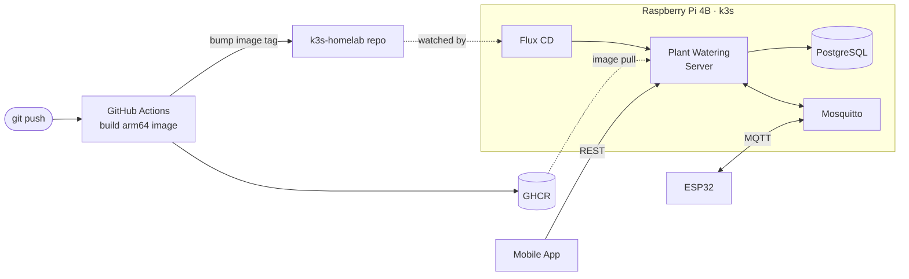

<div align="center">

# 🏠 k3s Homelab

**Single-node Kubernetes on a Raspberry Pi 4B — self-hosting my own apps with GitOps.**


</div>

---

## ✨ Overview

| | |
|---|---|
| **Board** | Raspberry Pi 4B (2 GB RAM) |
| **OS** | Raspberry Pi OS Lite 64-bit (Trixie) |
| **Kubernetes** | k3s v1.35.4 (single node) |
| **Network** | OpenWrt router with AdGuard Home |
| **Delivery** | GitHub Actions → GHCR → Flux CD |

## 🗺️ Architecture



**How a deploy works:** a push to the app repo builds an arm64 image, pushes it to GHCR and commits the new image tag into this repo. Flux notices the commit and rolls out the new version — no manual `kubectl apply`.

## 🚀 Running Services

| Service | Namespace | Access |
|---|---|---|
| 🌱 Plant Watering System Server | `apps` | `http://<PI-IP>:30080` |
| 📡 Mosquitto (MQTT broker) | `apps` | `mqtt://<PI-IP>:31883` |
| 🐘 PostgreSQL | `database` | cluster-internal · NodePort `32432` for local dev |
| 🔄 Flux CD | `flux-system` | internal GitOps controller |

<details>
<summary><b>💤 Not currently running</b> (uninstalled to save RAM)</summary>

| Service | Namespace | Values |
|---|---|---|
| Grafana | `monitoring` | [`infra/monitoring/grafana/values.yaml`](infra/monitoring/grafana/values.yaml) |
| Prometheus | `monitoring` | [`infra/monitoring/prometheus/values.yaml`](infra/monitoring/prometheus/values.yaml) |

</details>

## 📁 Repository Layout

```
k3s-homelab/
├── ansible/                 # Automated Pi + k3s provisioning
│   ├── inventory.ini
│   ├── playbook.yml
│   └── roles/               # common, k3s-server, k3s-agent
├── infra/                   # Kubernetes manifests (see infra/README.md)
│   ├── apps/                # mosquitto, plant-watering-system-server
│   ├── database/            # PostgreSQL
│   ├── flux/                # GitRepository + Kustomization
│   └── monitoring/          # Grafana, Prometheus (values saved, not running)
└── docs/
    └── setup.md             # Complete manual setup guide
```

## ⚡ Quick Start

> **Prerequisites:** `kubectl` and `helm` installed locally, kubeconfig pointing at `https://<PI-IP>:6443`.

```powershell
kubectl get nodes          # node should be Ready
kubectl get pods -A        # all workloads across namespaces
kubectl top pods -A        # memory/CPU usage per pod
```

📖 Full manual walkthrough: [`docs/setup.md`](docs/setup.md) · Manifest details: [`infra/README.md`](infra/README.md)

## 🤖 Provisioning with Ansible

The playbook prepares the Pi and installs k3s in one run.

| Role | What it does |
|---|---|
| `common` | Updates system packages, sets memory cgroup kernel parameters (single-line `cmdline.txt`), reboots if needed |
| `os-tuning` | Journal in RAM, `noatime`, zram-only swap, Bluetooth/Wi-Fi off, unused services masked — fewer SD card writes |
| `k3s-server` | Writes a trimmed `/etc/rancher/k3s/config.yaml` (no Traefik/servicelb, no leader election) and installs k3s (pinned version) |
| `k3s-agent` | Joins worker nodes (none configured yet) |

<details>
<summary><b>1. Prerequisites</b></summary>

- Raspberry Pi OS Lite (64-bit) flashed with Raspberry Pi Imager: hostname, user and **SSH public key** set in the Imager
- WSL (Ubuntu) on Windows — Ansible does not run natively on Windows
- Ansible in a WSL virtualenv (no sudo needed):

```bash
python3 -m venv --without-pip ~/.venvs/ansible
curl -sSL https://bootstrap.pypa.io/get-pip.py | ~/.venvs/ansible/bin/python
~/.venvs/ansible/bin/pip install ansible-core
```

- Your SSH private key in WSL `~/.ssh/` with `chmod 600` (keys under `/mnt/c` are rejected as too open)

</details>

<details>
<summary><b>2. Configure the inventory</b></summary>

Copy the template and fill in real values — `inventory.local.ini` is gitignored:

```bash
cp ansible/inventory.ini ansible/inventory.local.ini
```

```ini
[k3s_server]
raspberry4b ansible_host=<PI-IP> ansible_user=<your-user>

[all:vars]
k3s_server_ip=<PI-IP>
```

</details>

<details>
<summary><b>3. Run the playbook</b></summary>

From WSL (after re-flashing, remove the old host key first: `ssh-keygen -R <PI-IP>`):

```bash
cd /mnt/c/Users/<you>/Desktop/Projects/k3s-homelab/ansible
# Note: ansible.cfg is ignored under /mnt/c (world-writable dir) - not needed, roles are found next to the playbook
~/.venvs/ansible/bin/ansible-playbook -i inventory.local.ini playbook.yml -K
```

- `-K` (`--ask-become-pass`) asks for the Pi user's sudo password — the Imager-created user needs it on Raspberry Pi OS Trixie.
- The playbook reboots the Pi up to twice and waits for it; the first run takes 15–25 min (package upgrade).
- If your WSL SSH key differs from the key you put into the Imager, copy that key into WSL under its own name (e.g. `~/.ssh/id_ed25519_pi`, `chmod 600`) and set `ansible_ssh_private_key_file` in `inventory.local.ini`.
- The inventory's SSH keepalive (`ansible_ssh_common_args`) makes a connection that silently dies during the package upgrade fail after ~2 minutes instead of hanging; just re-run the playbook.

Local test of the `cmdline.txt` logic (no Pi needed):

```bash
~/.venvs/ansible/bin/ansible-playbook -i localhost, -c local tests/test_cmdline.yml
```

</details>
